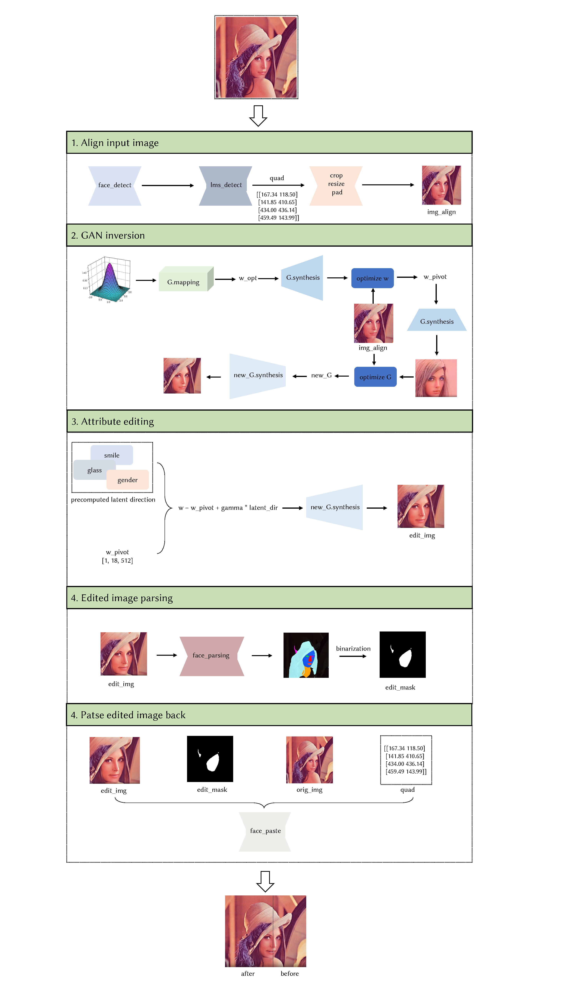

# 人脸编辑管线

​	该仓库是一个简单的人脸属性编辑管线，结合了一些经典技术和现成的深度学习模型来实现人脸表情编辑，适合初学者学习。



## 框架

```
.
├── assets
│   └── ...
├── attributes
│   └── ...
├── common
│   ├── basemodel.py
│   ├── __init__.py
│   ├── svm_util.py
│   └── tools.py
├── config
│   └── cfg.yaml
├── scripts
│   ├── run_generate_data.py
│   ├── run_predict_score.py
│   └── run_svm.py
├── input
│   └── ...
├── modules
│   ├── models
│		├── face_alignment
│   │   │   ├── face_alignment.py
│   │   │   └── networks
│   │   │	└── ...
│   │   ├── face_editing
│   │   │   └── face_editing.py
│   │   ├── face_generator
│   │   │   ├── face_generator.py
│   │   │   └── networks
│   │   │	└── ...
│   │   ├── face_inversion
│   │   │   └── face_inversion.py
│   │   ├── face_parsing
│   │   │   ├── face_parsing.py
│   │   │   └── networks
│   │   │	└── ...
│   │   └── face_paste
│   │       └── face_paste.py
│   └── weights
|       └── ...
├── output
│   └── ...
└── edit.py
```

## 预训练模型

​	预训练模型存储在`./modules/weights`中，按以下方式组织。

```
.
├── face_alignment
│   ├── 2DFAN4-11f355bf06.pth.tar
│   └── s3fd-619a316812.pth
├── face_editing
├── face_generator
│   └── ffhq.pkl
├── face_inversion
│   └── vgg16.pt
├── face_parsing
│   ├── 79999_iter.pth
│   └── resnet18-5c106cde.pth
└── face_paste
```

- face_alignment

从[这里](https://www.adrianbulat.com/downloads/python-fan/2DFAN4-11f355bf06.pth.tar)下载 `2DFAN4-11f355bf06.pth.tar`，从[这里](https://drive.google.com/file/d/1IWqJUTAZCelAZrUzfU38zK_ZM25fK32S/view)下载`s3fd-619a316812.pth`。

这两个模型是常用的面部关键点检测模型。

- face_generator

从[这里](https://nvlabs-fi-cdn.nvidia.com/stylegan2-ada-pytorch/pretrained/)下载 `ffhq.pkl`。基于在[FFHQ数据集](https://github.com/NVlabs/ffhq-dataset)上训练的StyleGAN2。

- face_inversion

从[这里](https://nvlabs-fi-cdn.nvidia.com/stylegan2-ada-pytorch/pretrained/metrics/vgg16.pt)下载 `vgg16.pt`。用于计算[LPIPS损失](https://github.com/richzhang/PerceptualSimilarity)。

- face_parsing

从[这里](https://drive.google.com/file/d/154JgKpzCPW82qINcVieuPH3fZ2e0P812/view)下载 `79999_iter.pth`，从[这里](https://download.pytorch.org/models/resnet18-5c106cde.pth)下载`resnet18-5c106cde.pth`。它基于[修改的BiSeNet](https://github.com/zllrunning/face-parsing.PyTorch?tab=readme-ov-file)并在[CelebAMask-HQ数据集](https://github.com/switchablenorms/CelebAMask-HQ)上进行了训练，用于语义分割。

## 环境

​	本项目的环境与一般的深度学习项目相似，这里只列出开发环境的主要部分。如果您的环境中缺少某些库（`opencv-python`，`scipy`），只需使用pip安装即可。

- Python == 3.8
- PyTorch == 1.11
- CUDA == 11.3 
- imageio-ffmpeg == 0.4.8    （用于保存`.mp4`文件）
- ninja == 1.11.1.1   （用于编译StyleGAN操作）

## 使用方法

​	通过以下命令运行项目：

```
python edit.py --input_dir ./input --output_dir./output --dir_path ./attributes/smile.npy --config ./config/cfg.yaml --gamma 1.5 [--save_cache] [--save_media] [--change_hair] 
```

- `--input_dir`：输入图像所在文件夹的路径，默认为`./input`。（由于H264编解码器，图像的宽度和高度需要是2的倍数。）
- `--output_dir`：结果将保存到的文件夹的路径，默认为`./output`。
- `--dir_path`：带有特定属性的目录文件的路径，默认为`./attributes/smile.npy`。
- `--config`：配置文件的路径，默认为`./config/cfg.yaml`。
- `--gamma`：编辑强度的值，默认为`1.5`。
- `--save_cache`：确定是否保存缓存（微调生成器、优化出的$\mathcal{W}$等），选项为`True`或`False`，默认为`False`。
- `--save_media`：确定是否保存`.mp4`媒体文件，选项为`True`或`False`，默认为`False`。
- `--change_hair`：确定是否在`Face_Parsing`中掩盖头发，默认为`False`。在长发的情况下，最好将此参数设置为`False`。

## 编辑方向

​	该仓库使用了来自[generators-with-stylegan2](https://github.com/a312863063/generators-with-stylegan2/tree/master/latent_direction)的latent code，感谢仓库作者无私的分享。此外，在`./scripts`中，该仓库还提供了通过SVM和[CLIP](https://openai.com/research/clip)计算潜在方向的简单脚本。

​	从[这里](https://openaipublic.azureedge.net/clip/models/40d365715913c9da98579312b702a82c18be219cc2a73407c4526f58eba950af/ViT-B-32.pt)下载 `ViT-B-32.pt`，然后运行以下命令：

```
# 生成图像和潜在代码w
python ./scripts/run_generate_data.py
# 通过CLIP为每个图像预测分数
python ./scripts/run_predict_score.py --pos_text <positive prompt> --neg_text <negative prompt>
# 运行SVM以寻找边界
python ./scripts/run_svm.py -s <predict score path>
```

## 可视化

​	由于该仓库只是将一些现有的经典的技术结合在一起，所以实现效果的提升空间很大。此外，由于大多数模型都是在主体为欧美人群的数据集中训练的，所以并不是任意一张图像都能达到令人满意的编辑结果。

- Smile

https://github.com/zjwfufu/Face-Editing-Pipeline/assets/85010710/f99db5a4-35e4-4914-a611-64ce9b23cca9

https://github.com/zjwfufu/Face-Editing-Pipeline/assets/85010710/b9e3594c-79af-40e3-9bcd-5a5961f150b2

- Glasses

https://github.com/zjwfufu/Face-Editing-Pipeline/assets/85010710/0752f76d-7dfc-4699-a300-de08f0df8964

https://github.com/zjwfufu/Face-Editing-Pipeline/assets/85010710/2052ecb4-8ef7-4a25-a6c8-bb8cea479882

- Age

https://github.com/zjwfufu/Face-Editing-Pipeline/assets/85010710/cf4c145c-9722-4714-9093-4aadc8441e19

https://github.com/zjwfufu/Face-Editing-Pipeline/assets/85010710/815c7e04-51f2-4ccc-ad23-563d4e20f9f2


## 参考

- [stylegan2-ada-pytorch](https://github.com/NVlabs/stylegan2-ada-pytorch)
- [PTI: Pivotal Tuning for Latent-based editing of Real Images](https://github.com/danielroich/PTI)
- [FFHQ alignment](https://github.com/chi0tzp/FFHQFaceAlignment)

- [face-parsing.PyTorch](https://github.com/zllrunning/face-parsing.PyTorch)
- [generators-with-stylegan2](https://github.com/a312863063/generators-with-stylegan2/tree/master)

## 致谢

感谢OPPO的DongFang Hu对这个代码的审查。
